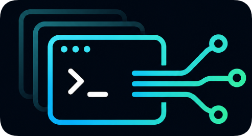

<div id="top">


<p align="center">
    </img>
  <h1 align="center">termcp</h1>
  <p align="center"><em>让 AI Agent 拥有交互式终端能力。</em></p>
</p>


<p align="center">
  <a href="https://github.com/open-mcp-ai/termcp/stargazers">
    
  </a>
  <a href="https://github.com/open-mcp-ai/termcp/forks">
    
  </a>
  
  
  <a href="./LICENSE">
    
  </a>
</p>


<p align="center">
  <strong>中文</strong> | <a href="./README.md">English</a>
</p>


---

## 简介

`termcp `是一个go语言编写的包含MCP服务器，以**SSH**会话的形式，让AI Agent能够持续地管理、调度交互式程序。此外，termcp还有专门用于管理这些会话的界面，使得用户能够完整地观测AI Agent的行为。同时用户能够像使用SSH一样，直接与受控机器进行交互或调整AI Agent行为。

https://github.com/user-attachments/assets/d06a3c36-250a-4eeb-aefa-e80d13d1551c

## 为什么选 termcp

### 打破边界

Agent 原生只能执行一次性命令，运行完就返回。但现实中有大量工作是**多轮交互**的，例如：

- SSH 登录一台主机，先输密码，_再_执行命令。
- 在 Python REPL 里逐行调试代码。
- 回答安装程序里深埋的 `[Y/n]` 提示。
- 驱动 `top`、`htop`、或 impacket 这类终端依赖型工具。

这些场景里进程持续运行，Agent 必须在**多个对话轮次间读写进程的 I/O**。由此诞生了许多专门的MCP，但是为什么不直接赋予Agent双手，让他能够直接交互呢？`termcp`让 AI Agent打破了进程交互的边界，不再需要为每个交互工具安装编写单独的mcp，使其能够直接地持续管理、调度交互式程序，如**TUI**、**REPL**、**GDB**、**msfconsole**、**vim**等。

### 可视化管理

`termcp` 提供了一个会话管理界面，让你和 Agent 对进程里正在发生的一切一目了然:

- **多会话仪表盘**:所有正在运行的会话都在这里，以名称区分，随时切换，随时接管。
- **实时 AI Agent 行为观测**:像操作本地终端一样，直接在浏览器里看到 `htop` 的动态界面、`vim` 的编辑过程，或者安装程序弹出的彩色提示，不再对着"黑盒"猜测。
- **标签化管理**:一个 SSH 会话下可开多个操作shell，每个 shell 在 UI 里是独立标签页，Agent 在 A 标签调试、在 B 标签查日志，互不干扰。
- **端口转发可视化**：会话相关的所有端口转发等功能参数都列在面板里，本地/远程端口、协议一目了然。
- **文件管理**：在管理界面里直接浏览目录、上传下载、重命名、建目录。
- **连接模板集中托管**：提供统一的SSH配置管理，如果不想让Agent知道ssh具体配置，只需要告知Agent需要使用的ssh配置文件。

## 快速导航

- [功能特性](#功能特性)
- [快速开始](#快速开始)
- [使用](#使用)
- [Docker 部署](#docker-部署)
- [接入 MCP 客户端](#接入-mcp-客户端)
- [示例](#示例)
- [工具参考](#工具参考)
- [已知限制](#已知限制)

## 功能特性

- **🟦 支持多轮交互** —— 进程持续运行，Agent 可跨多个对话轮次驱动，而非一次性调用即返回。
- **🟪 真实终端环境** —— 完整模拟真实终端，`vim`、`top`、`gdb` 等依赖终端特性的程序均可正常运行，跨平台兼容。
- **🟧 内建可视化界面** —— 浏览器即可访问实时终端、会话列表、历史输出回放，单端口提供服务，无需额外部署。
- **🟨 多 Agent 并行不冲突** —— 多个 Agent 可同时读取同一会话，各自维护独立游标，输出互不抢占。
- **🟩 远程操作一体集成** —— 单条 SSH 连接内完成命令执行、文件传输与端口转发，无需重复建立连接。
- **🟥 事件通知（反向唤醒）** —— `shell_notify` 注册后，进程退出 / 输出停顿 / 有新输出时由 termcp 主动唤醒 Agent（仅信令、不带内容），无需持续轮询；Web UI 可查看与拆下已注册规则。

## 快速开始

### 下载

前往 Releases 页面,下载对应平台的预编译二进制:

| 平台                  | 文件                       |
| :-------------------- | :------------------------- |
| Linux (x86_64)        | `termcp-linux-amd64`       |
| Linux (ARM64)         | `termcp-linux-arm64`       |
| macOS (Intel)         | `termcp-darwin-amd64`      |
| macOS (Apple Silicon) | `termcp-darwin-arm64`      |
| Windows (x86_64)      | `termcp-windows-amd64.exe` |
| Windows (ARM64)       | `termcp-windows-arm64.exe` |

### 编译

```bash
# 克隆
git clone https://github.com/open-mcp-ai/termcp.git
cd termcp

# 编译
go build -o termcp .

# 运行（默认：loopback，端口 18765；数据存于 ~/.termcp）
./termcp
```

浏览器打开 `http://127.0.0.1:18765` 即可进入 **Web 界面**。

## 使用

### 命令行

```text
termcp [flags]
```

| Flag            | 默认值      | 说明                                                         |
| --------------- | ----------- | ------------------------------------------------------------ |
| `--host`        | `127.0.0.1` | HTTP 绑定地址。`0.0.0.0` 监听所有网卡。                      |
| `--port`        | `18765`     | HTTP 端口。Web UI、MCP SSE、MCP streamable HTTP 共用。       |
| `--data-dir`    | `~/.termcp` | 持久化目录（会话、消息、SSH 配置）。不存在则自动创建。默认值可用环境变量 `$TERMCP_DATA_DIR` 覆盖。 |
| `--log-level`   | `info`      | 日志级别：`debug` / `info` / `warn` / `error`。`debug` 显示全部 MCP 工具调用；失败的工具调用与会话创建错误始终以 `warn`/`error` 打印。 |
| `--no-internal` | `false`     | 禁用内建 loopback SSH profile。                                |
| `--mcp-manage-ssh-configs` | `false` | 允许 AI 通过 MCP 管理 SSH 配置（凭据永不暴露）。                |

### 示例

```bash
# 监听所有网卡
./termcp --host 0.0.0.0

# 允许 AI Agent 管理 SSH 配置
./termcp --mcp-manage-ssh-configs
```

## Docker 部署

### 多阶段构建：添加到任意容器

将下面的 `Dockerfile` 放到应用项目中。构建阶段通过 `go install` 安装 termcp，再用 `COPY --from` 把二进制文件复制到目标镜像；目标容器不需要安装 Go 运行时：

```dockerfile
# syntax=docker/dockerfile:1

# 可在构建时替换为可访问的 Go 基础镜像
ARG GO_IMAGE=golang:1.25-alpine
FROM ${GO_IMAGE} AS termcp-build

# Go 模块加速；海外环境可改为 https://proxy.golang.org,direct
ARG GOPROXY=https://goproxy.cn,direct
ENV GOPROXY=${GOPROXY}
ENV GOBIN=/out

# 生产环境建议将 latest 固定为具体版本，例如 @vX.Y.Z
RUN go install github.com/open-mcp-ai/termcp@latest

# 替换为任意目标基础镜像
FROM alpine
COPY --from=termcp-build /out/termcp /usr/local/bin/termcp
```

> `go install` 会从 Go 模块代理下载 termcp 及其依赖。`GOPROXY` 默认使用 `goproxy.cn`；也可以通过 `--build-arg GOPROXY=...` 替换。若 Docker Hub 访问较慢，可通过 `--build-arg GO_IMAGE=...` 指定可用的 Go 基础镜像镜像源。

### 启动命令示例

```bash
# 构建包含 termcp 的应用镜像
# 也可以同时指定企业内网或其他可用的 GOPROXY / Go 基础镜像
docker build \
  --build-arg GOPROXY=https://goproxy.cn,direct \
  -t my-app-with-termcp .

# 以 termcp 作为容器主进程
# 容器内必须监听 0.0.0.0，数据目录应挂载为持久化卷
docker run -d --name my-app-termcp \
  -p 18765:18765 \
  -v termcp-data:/data \
  --entrypoint /usr/local/bin/termcp \
  my-app-with-termcp \
  --host 0.0.0.0 --port 18765 --data-dir /data

# 开启 MCP SSH 配置写入工具（按需使用）
docker run -d --name my-app-termcp \
  -p 18765:18765 -v termcp-data:/data \
  --entrypoint /usr/local/bin/termcp \
  my-app-with-termcp \
  --host 0.0.0.0 --data-dir /data --mcp-manage-ssh-configs

# 查看日志
docker logs -f my-app-termcp
```

如果需要与原应用进程在同一个容器中同时运行，应在原有 entrypoint 或进程管理器中启动：

```bash
/usr/local/bin/termcp --host 0.0.0.0 --port 18765 --data-dir /data
```

Docker 容器通常只运行一个前台进程；若应用仍需作为主进程运行，建议将 termcp 放在同一 Docker 网络的独立服务中，并通过 `http://termcp:18765/stream` 访问。

### Docker Compose 启动

```yaml
services:
  termcp:
    build:
      context: .
      args:
        GOPROXY: https://goproxy.cn,direct
    entrypoint: ["/usr/local/bin/termcp"]
    command: ["--host", "0.0.0.0", "--port", "18765", "--data-dir", "/data"]
    ports:
      - "18765:18765"
    volumes:
      - termcp-data:/data

volumes:
  termcp-data:
```

```bash
docker compose up -d --build
```

## 接入 MCP 客户端

### Claude Code（SSE）

```json
{
  "mcpServers": {
    "termcp": {
      "type": "sse"，
      "url": "http://your-server:18765/sse"
    }
  }
}
```

或用 CLI：

```bash
claude mcp add --transport sse termcp http://localhost:18765/sse
```

### Open WebUI（Streamable HTTP）

将 Open WebUI 指向 `http://<host>:18765/stream`。

- 同机：`http://127.0.0.1:18765/stream`。
- Open WebUI 在 Docker 内、termcp 在宿主机：`http://host.docker.internal:18765/stream`（macOS/Windows），或宿主机局域网 IP。
- 两者都在 Docker 内（同一网络，见 [Docker 部署](#docker-部署)）：`http://termcp:18765/stream`。

### 其他 MCP 客户端

- SSE 传输 → `http://<host>:<port>/sse`
- Streamable HTTP → `http://<host>:<port>/stream`


---

